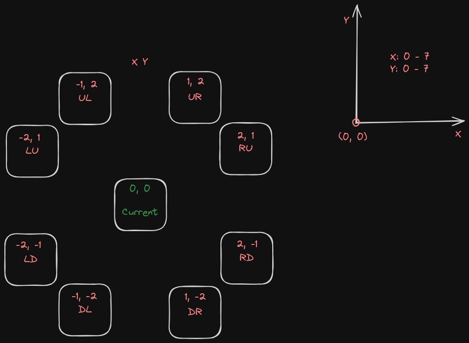

# Knights Travails

This page takes two inputs from you and calculates the fastest path for knight in chess!\
[Live preview](https://bigacz.github.io/knights-travails/)

## Approach

I use an undirected with graph called board, each vertex has 2-8 deegrees.\
For searching for the shortest path I utilize a level order traversing algorithm.

### TODO:

Add mediaquery when screen is small to add how to below the board
